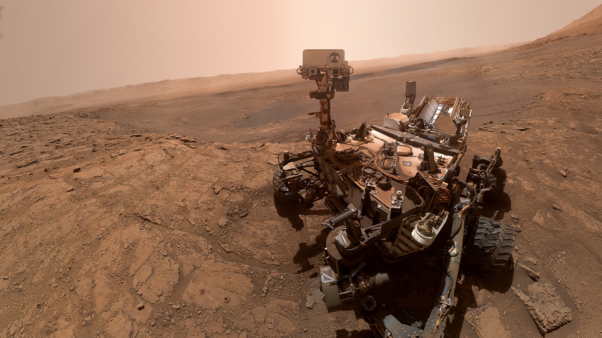

# 💡 Mars Rover Simulation
This is an Augmented Reality Experience showcasing the Mars Curiosity Rover at your home, it is currently under development and has been developed with MRTK and AR Foundation for Android Devices

# ⚒️ Development Tools
- Unity Engine 2020
- AR Foundation 4.2.3
- AR Core XR Plugin 4.2.3
- MRTK 2.8.3

# 💡 Mars Curiosity Rover Demo
